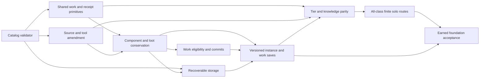

# Dependency-ordered build roadmap

**Revision 3 C6 addendum; C1-C5 independently cleared and selected provisional defaults.** F01's bounded validator, F04's existing locality/hold/restore-input correction and F05's single-file recovery are independently implemented/approved at a52a347; future package scope remains pending. [Bounded closure checklist](review-closure-v3.md) lists only the six follow-up issues and exact decisions. `work-packages.json` is the machine dependency source; no completed narrow batch is renamed full package acceptance.

## Foundation order

| Work | Concrete delivery | Exit gate |
| --- | --- | --- |
| F01 | Typed production catalog/source/exposure validation with exact row/caller paths | A01/A02; seedless cycles and diagnostic-only edges cannot pass production validation |
| F02 | Reviewed source amendment for wrench, forms, books/gauze and required recipe inputs, or truthful defer disposition | A01/A02/A11; selected F02-A, with actual descriptor/physical/source qualification before production placement |
| F04A | Early WorkEligibility/WorkTransactionState/IWorkCommitPort and record-only TrainingEventBus.RecordApplied; isolated clones/fake port, no live writer | A39; kernel and log/replay fixtures pass before F03 overhaul/F07 study consumers |
| F03 | Unique component holder/condition conservation, UI instance commands, paid legacy Inspect/Overhaul and retryable loot remainders through one atomic owner | A03/A04/A31/A32/A36 in-memory/domain/UI units; actual Continue/preflight waits for F06 |
| F04 | Downstream session/HUD/action integration of F04A work kernel with F03 atomic owner; F03 dependency retained | A05/A06/A32 package units; range/LOS/context/restore cannot cause remote work; narrow locality correction is separable |
| F05 | Pure storage portion is delivered narrowly; full F05 waits for F03's committed bundle/revision, then adds complete slot assembly/generations/index/frozen guards | A07/A08/A34 supplied-payload disk units plus F03-owned actual assembly; existing single-file pass cannot close complete generations |
| F06 | Run7/world5 migration, reachable unknown-resolution preflight, visible unverified legacy craft choices and paused restore | A06/A09/A32/A33/A34/A35/A36; originals retained, no previous-health/payment inference or automatic legacy output/refund; class journeys wait for F08/F09 |
| F07 | Phase gates, paid-input completion and retained study using upstream F04A RecordApplied | A11/A33/A35/A38 including ManualStudyPanelTests XML; exact nozzle book/tier path; one input set through outage/Continue; unsafe queue disabled |
| F08 | Selected provisional finite utilities/recovery and actual class/order validation, consuming early record-only logs | A02/A37 including AuxiliaryUtilityViewPlayModeTests XML; A10 downstream F09; all 11 configured, eight fresh Title plus earned unlocks; no perk/grant shortcuts |
| F09 | Normal acquisition, interruption, actual Continue/revisit, class routes and repeated basic excursions | A03/A04/A05/A06/A10/A11/A31/A33/A35..A38 actual input portions, plus native first-ship witness; legacy fixtures labeled; A29 full accessibility remains P02/L01; never pass earned gates with grants |

The [foundation plan](../../superpowers/plans/2026-10-02-synaptic-sea-foundation.md) defines exact task files/signatures and verification steps. Pure F05 storage work is independent of source/instance choices; full gameplay SavePayloadAssembler integration depends on F03. F02-A, utilities/recovery, retained study, paid overhaul and conservative legacy choices are selected provisional defaults. Numbers remain tunable hypotheses; physical/finite/survival/all-class acceptance is required. This documentation task changes no product data.

## Integration stages

| Work | Dependencies | Delivery and decisions | Acceptance |
| --- | --- | --- | --- |
| P01 | F07 | Truthful launch/current difficulty, visible captions, current-vs-historical alerts, inert controls | A12/A13 |
| P02 | P01/F06 | Actual scene/audio lifetime, listener and native/HUD accessibility validation; OPEN-11 budget | A27/A29 |
| H01 | F06/F07/F09 | Per-vessel services/production, actual access and local power; preserve onboarding safety separately | A14 |
| H02 | F04/F06 | Typed internal/outside boundaries and edit invalidation across physics/nav/perception/fire | A15/A22/A24 |
| H03 | H01/H02 | Explicit conduit/door networks; settle OPEN-02 before atmosphere math | A16 |
| M01 | H01/H02/F09 | Earned repair/propulsion assemblies and A-B-C reversible joins, scout utility | A17/A18 |
| S01 | F06/H01 | Active registry and partitioned persistent state with bounded working set; choose hardware budget before certification | A19 |
| S02 | S01/H02 | Explicit in-run absent advancement, saved cursors and no silently discarded time; OPEN-01/03, independent OPEN-04 offline gate | A20 |
| S03 | H01/S02/F09 | Care/food/water/repair resource loops and storage ageing; OPEN-09 exact economy amendment | A21/A28 |
| G01 | F02/H02 | Versioned generated opportunities and physical damaged/furnished/multideck checks | A24 |
| G02 | F06/G01 | Companion decision reconciliation, selected approved library provenance and actual normal encounter | A25/A26; OPEN-13 before import |
| S04 | H02/S02/S03/G01 | Bounded colony territory/resource/response, if OPEN-10 approves | A22/A23 |
| M02 | M01/S03 | Towing/connector/cost extension if OPEN-09/12 approves | A30 |
| L01 | P02/H03/M01/S03/G01/G02 | Reviewed long-haul campaign/native acceptance and release evidence packet | A14..A25/A27..A30 as approved features; no optional subsystem assumed mandatory |

S04/M02 are decision-conditional; L01 can release without them if explicitly deferred and product messaging matches. Approved survival, home/repair mobility and useful scouts remain mandatory. G02 production-creature scope is conditional on OPEN-13; the horror threat gameplay must still have usable readable presentation and persistent behavior.

## Review gates and maintainability

For each later stage: review concrete subsystem amendment + scoped plan -> implement minimal service/adapters -> validate current Core/session callers -> instantiated discriminators -> normal earned acceptance -> record immutable evidence. Each completed package should be locally reviewable; no remote push/PR/merge is part of this program.

Keep `RunSession` as composition, moving only touched ownership/eligibility/transaction responsibility into focused files. Do not collect all logic in a new universal coordinator. Dependent tasks consume exact contract signatures and normalized records. Changes to TickOrder or InteractionRegistry include their existing doc-parity checks. Definition/source validation must run for every new content addition and profile publication.

DomainTransactionCoordinator coordinates atomic publication of a bounded domain bundle; catalog rules, action eligibility, recipes, topology, simulation and UI stay in their owning subsystems. It is the transaction owner, not a universal gameplay service.

Future acceptance packets record revision, dirty tree, content/schema versions, tool/engine versions, source/build hashes, run seed/class/unlocks/settings, input method, provisioned state and expected/actual. Publish measured failures and limits, not a campaign percentage derived from model coverage. Historical build/fixture passes remain attributed to their original source.
