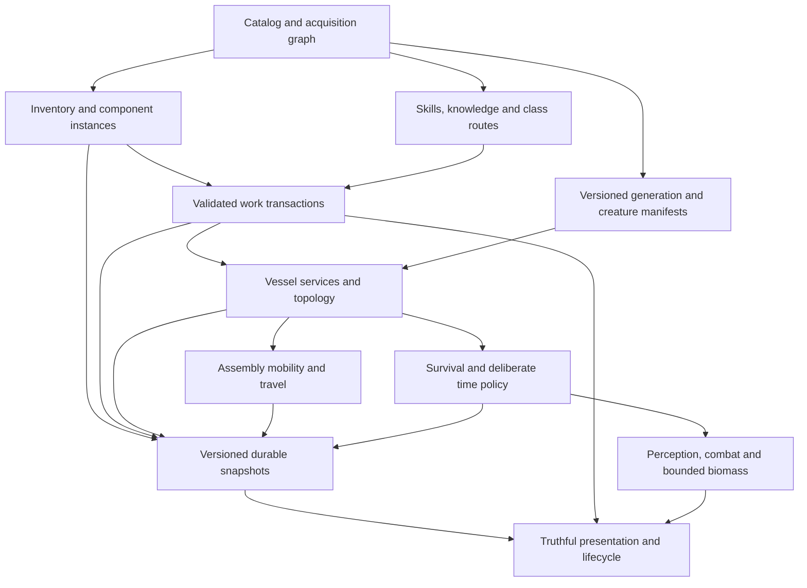

# Synaptic Sea master design

**Status:** proposed architecture for written review, 2026-10-02. **Baseline:** local `840f14f`; evidence authority is [deep audit](../../audit-deep/README.md). See [program index](../../design/formal-build-2026-10-02/README.md) for contracts, plans and traceability. This document defines a build program, not a claim that the game already fulfills it.

## 1. Approved product requirements

| ID | Requirement | Observable success |
| --- | --- | --- |
| REQ-01 | Project Zomboid-like long-haul survival in space horror | Shelter, care, supplies, damage and decisions matter over repeated expeditions in the same persistent life |
| REQ-02 | Discover, scavenge and repair derelict spacecraft | Useful equipment is earned through traversable sources, tool use and repair, and stays changed on revisit |
| REQ-03 | Weld useful hulls into homes; support stationary and mobile homes | Owned vessels retain identity and local services while connected, moved and detached |
| REQ-04 | Generally fly any sufficiently repaired vessel/assembly with propulsion appropriate to load/size | Capability depends on eligible machinery, power, load and configuration rather than a static home-only hull class |
| REQ-05 | Small recon, scavenging and immediate escape craft retain utility | Independent excursions and detach/return remain useful alongside a larger home |
| REQ-06 | No extraction-victory loop | Onboarding completion and normal return preserve the world and active survival; no payout/save deletion as ordinary success. Amended by D8 (`docs/design/decisions.md`): death starts a new survivor in the same world, with no roguelite meta-payout or save freezing |
| REQ-07 | Every starting class can establish a home and repair a first ship solo | All supported class routes pass with finite earned resources; specialization changes methods/cost/time without removing meaningful skill/tool gates. Satisfied by D6 (`docs/design/decisions.md`): any class can repair slowly at low quality, and skill is a multiplier |
| REQ-08 | Preserve user work, saves and proprietary assets | Additive versioned changes, reversible migration and exact provenance; no reset to published main |

REQ-07 is approved policy. It does not approve equal starting skills, universal advanced fabrication, free resources, or bypassing locks. For unlockable classes, acceptance uses legitimately established unlock state, with no hub repair/XP benefits presumed. Directly configured classes are diagnostics only.

## 2. Scope and deliberate limits

Committed loop: assess a contact -> prepare small craft and carried tools -> explore, evade/fight, acquire finite resources -> return and unload -> treat/rest/resupply -> repair and adapt shelter -> make another expedition. Repaired derelicts may become independent craft or mechanically connected home members. Mobility is another configuration capability, not a win condition.

Full Newtonian flight, 6DOF, arbitrary mesh cutting, detailed EVA/tethers, NPC crews, multiplayer, ML and autonomous collectors are optional. They create no implementation dependencies here. Biomass resource/territory/adaptation remains a bounded concept proposal. A future eventual escape feature would need its own design and must not replace ordinary survival.

No design assumption finalizes world-to-real time ratio, atmosphere fidelity, closed-game simulation, survival rates, fuel/economy prices or target hardware. [Open decisions](../../design/formal-build-2026-10-02/decisions.md) state alternatives, evidence and decision deadlines. Death succession is decided (D8, `docs/design/decisions.md`); the existing death/frozen-save behavior remains in code until Phase 3.6 implements it.

## 3. Current implementation and chosen direction

The checkout already has engine-free Core systems, `RunSession` partial adapters, versioned ship generation, per-ship summaries, local machinery/propulsion ownership, a durable reclaimed-home join and composite Unity navigation. `AssemblyMobility.Evaluate`, `HomeJoinPlanner.Validate`, `ComponentPlacementState`, `CraftingState`, portable treatment, wounds and `SaveLoadService` are useful foundations. Preserve working behavior and tests.

Three approaches were considered:

| Approach | Tradeoff | Recommendation |
| --- | --- | --- |
| Incremental subsystem boundaries around existing Core models and session composition | Requires compatibility adapters and disciplined removal of duplicate ownership; each delivery remains testable | Proposed; use this program |
| Extend another authored journey in `RunSession` | Fast local demonstration but multiplies special identity gates and disconnected producers | Reject as the overall architecture; authored onboarding still useful as an acceptance route |
| Replace with a new ECS/physics/world engine | Large migration cost, risks saved identities and masks source gaps; current evidence does not justify it | Reject for this program; reconsider only with measured constraints |

The preferred design introduces small authoritative services as touched work demands them. It keeps current asmdefs, C# 9-compatible Core and `GdDict` persistence adapters. It does not require all subsystems to move into new projects or a universal event-sourcing framework.

## 4. Subsystems and dependency flow

Persistence is designed alongside each producer, not deferred to the end of this visual flow. UI sends commands and presents committed state; it does not own repair, inventory, services or time. Generation creates immutable base identity and reachable opportunities; mutable per-ship state overlays that base.

| Subsystem | Owns | Existing anchors | Depends on |
| --- | --- | --- | --- |
| Catalog/acquisition | Definitions, ID resolution, source graph, content release manifest | `ItemDefs.LoadDefinitions`, `ComponentCatalog`, recipe/data loaders, `GameplaySliceBuilder.Build` | Resource loaders; no Unity |
| Inventory/components | Stack counts, unique equipment instances, holder and condition transitions | `InventoryState`, `ShipInventory`, `CargoTransfer`, `ComponentPlacementState`, `ComponentMountResolver` | Valid catalog |
| Work/crafting/progression | Eligibility, interruptible job state, ingredient/output commits, XP/knowledge provenance | `WorkActionDriver`, `CraftingState`, `FieldCraftingState`, `RecipeKnowledgeState`, `PlayerProgressionState`, `TrainingEventBus` | Inventory, target owner, catalog |
| Vessel habitat/topology | Local machinery/stations/production, rooms/boundaries, ownership and connections | `ShipInstance`, `RunSession.Ships`, `.HomeExtension`, `.Crafting`, `ModuleIntegrityMap`, `HomeJoinPlanner` | Work, persistent identity |
| Mobility/world registry | Validated assembly load, piloting, active/retained ships, discrete route mutation | `AssemblyMobility`, `DockingManager`, `RunSession.Travel`, `SeaGraph` | Vessel graph, machinery and cargo |
| Survival/time/threat | Local hazard exposure, care/recovery, ageing, explicit simulation policy, AI and colony budgets | `ShipRuntime.CatchUp`, `VitalsState`, `WoundState`, `SpoilageState`, `ThreatAIState`, `SpatialPerceptionState` | Owner/location topology, clock policy |
| Generation/asset release | Immutable profile/version/seed, placement witnesses, approved production library identity | `ShipGenerator`, `FirstRunAwayGate`, `RuntimeVisualCatalog`, `ThreatCreatureFactory` | Catalog, topology contracts, asset provenance |
| Persistence/recovery | Consistent snapshot generation, schema migration, recoverable commit, index repair | `RunSnapshotAssembler`, `WorldSnapshotAssembler`, `SaveMigrationService`, `SaveLoadService`, `FileSystemStorage` | All authoritative summaries |
| Presentation/lifecycle | Supported choices, reasoned feedback, captions, tutorial history, audio session binding | `TitleScreen`, `MenuCoordinator`, `SessionUiBridge`, `HudRoot`, `AudioManager`, `AppServices` | Read models and commands |

All anchors are existing local symbols; proposed new interfaces are labeled in [contracts](../../design/formal-build-2026-10-02/contracts.md). [Work packages](../../design/formal-build-2026-10-02/work-packages.json) provide full repository paths rather than implying these abbreviated filenames are a new layout.

## 5. Source-of-truth rules

1. Definitions are immutable catalog entries. `component_catalog.json` owns component mass/default condition/form mapping; inventory adapters derive or validate carried-form fields rather than inventing unrelated values.
2. A unique component has one `instance_id` and one holder: mounted slot, player inventory, ship cargo, cart, or persisted world drop. A slot is not a component identity. Transfers conserve identity, condition and mass.
3. A vessel owns machinery, local stations, production jobs, inventory and hazards. `HomeShip` becomes a reference for onboarding compatibility, not the permission authority for all shelter services. Ownership alone creates no equipment or free air/food.
4. Mechanical membership, electrical connectivity, air openings and storage containment are distinct relationships. A weld does not silently share power/air; a stowed engine never provides thrust.
5. A command validates target owner/revision; DomainTransactionCoordinator stages registry, placement, bag/cargo, machinery, job/payment, XP and receipts in one bundle and publishes once. Adapters cannot independently apply deltas. XP, noise, HUD updates and autosave derive from the committed outcome. Equal room/module IDs on different ships cannot cross-write.
6. A saved world owns simulation time and per-subsystem advancement cursors. Rendered state and loaded geometry do not determine resource outcomes. Explicit coarse approximations may differ, but their policy and unapplied time are saved.
7. Save manifests bind run, world and layout artifacts to one generation. `RunSnapshot` and `WorldSnapshot` are serializations of shared authorities, not competing writable stores.

## 6. Foundation first

The [foundation design](2026-10-02-synaptic-sea-foundation-design.md) delivers source/catalog validation, acquireable tool capability and all component forms, persistent component transactions, consistent work semantics, reliable save recovery, truthful station/knowledge checks and all-class solo bootstrap validation. It repairs the integration on which later systems depend.

The foundation must not claim a complete sustainable mobile-home campaign. That requires subsequent per-vessel services, topology, long-horizon resource/time policy, native presentation and repeated-expedition acceptance. Diagnostic provision of a nozzle, engine, condition value or claimed vessel must always be labeled.

## 7. Failure and interruption invariants

Every command either fails without domain mutation or commits a complete legal result. Multi-step work may retain progress and explicit material escrow, but cancellation never loses uncommitted unique equipment. Released hold, damage, death, target unload/change, invalid range/LOS and lost power have documented per-action behavior. Save/Continue never restores a physical held button. Container overflow preserves unaccepted contents. Save failure never deletes the previous validated generation. Failed scene/asset resolution reports an actionable reason and does not regenerate a different saved identity.

Process crashes and storage faults are tested separately from player cancellation. A displayed success must follow an actual commit. Native durability claims require filesystem fault probes, not only `MemoryStorage`.

## 8. Validation and acceptance

Current audit evidence: 643 model generation probes, 21 provisioned current-Core diagnostics, six instantiated GPU Play fixtures and 28 targeted Edit fixtures. The generator CSV `actual_seed` is invalid; use requested seed plus retained `program_id`. Inventory/coverage enumeration is not exhaustive semantic review. These bounds remain in every evidence summary.

Future release checks combine catalog/source contracts, state conservation, actual session adapters, collider/navigation and HUD/audio tests, and fresh normal acquisition journeys. [Acceptance](../../design/formal-build-2026-10-02/acceptance.md) defines all-class bootstrap, interruption, save/revisit, welded-home mobility and meaningful repeated expeditions. Passing model grants or fixture-opened doors cannot substitute for earned acceptance.

Traceability covers CONTENT-01..12, GEN-01..03, UI-1..8, all eight integrated priority findings, retained negatives and explicit unknowns. No claim that all 1,481 nonmetadata files without reconciled exact symbols have now been reviewed. New code at a seam gets a focused review; validators prevent new disconnected content from enlarging that gap.

## 9. Review and delivery boundary

Review the master, foundation, decisions, contracts and foundation plan together. Architectural proposals can be accepted independently of open product options. Implementation starts only after the written designs and first plan have been reviewed, as the user requested. No remote publication is implied. Later subsystem work uses this program as a dependency map and requires a concrete reviewed implementation scope, not an open-ended mandate to rewrite the game.

The parent has since admitted narrow F01 validation, current F04 locality/hold and existing-storage F05 recovery engineering. [Review amendments](../../design/formal-build-2026-10-02/review-amendments.md) preserve that staged admission while the full atomic/instance/paid-input/slot-generation contracts await corrected review. This planning task remains documentation-only.
